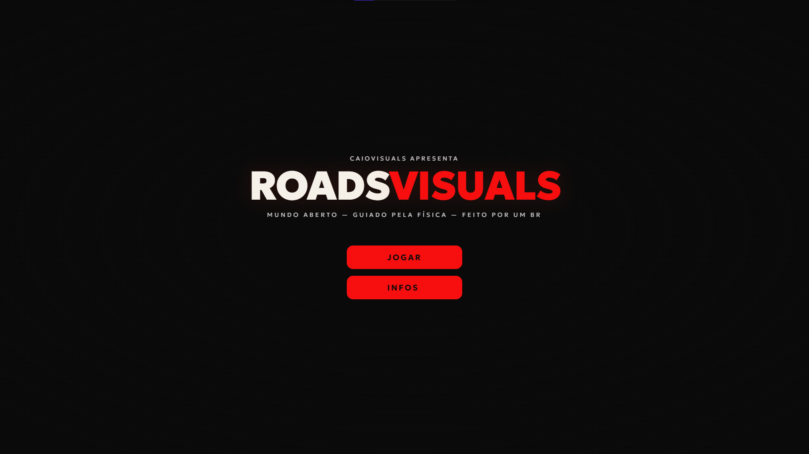
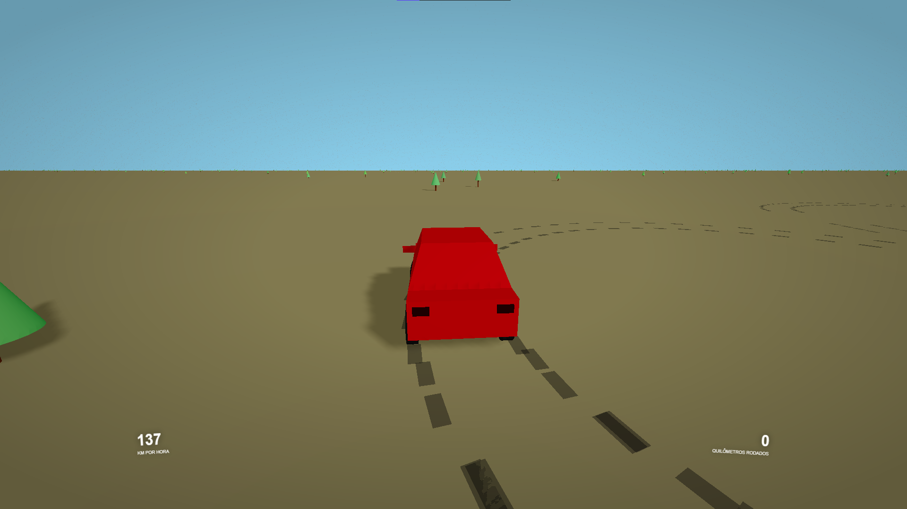
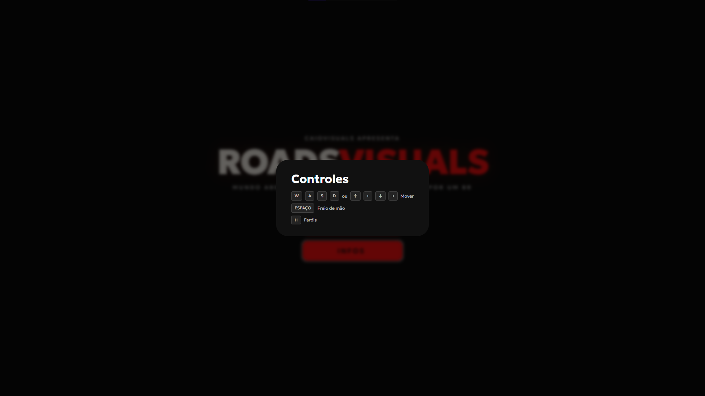

# ROADSVISUALS

Um jogo experimental inspirado no Slow Roads feito com vite, svelte, typescript, alea e threejs. Usando formulas físicas e calculos de movimentos. 
Você pode ficar a vontade para testar o jogo clonando o repositório ou acessando a demo:  
https://roadsvisuals.vercel.app

## Capturas de Telas

## Objetivos

- Estudar e aplicar movimento físico em ambientes 3D
- Explorar geração procedural de cenários
- Criar uma experiência inspirada em jogos relaxantes
- Evoluir conhecimentos em Three.js + Svelte
- Desenvolver um projeto visual autoral e experimental

## Dependências

O projeto foi desenvolvido com as seguintes dependências:

- **[Svelte](https://svelte.dev)** – ^6.0.0  
- **[Vite](https://vite.dev)** – ^7.0.4
- **[three.js](https://threejs.org)** – ^0.178.0  
- **[Alea](https://www.npmjs.com/package/alea)** – ^1.0.1 

by caiothevisual  
#caiobavisuals #roadsvisuals #cars #typescript #threejs #vite #svelte